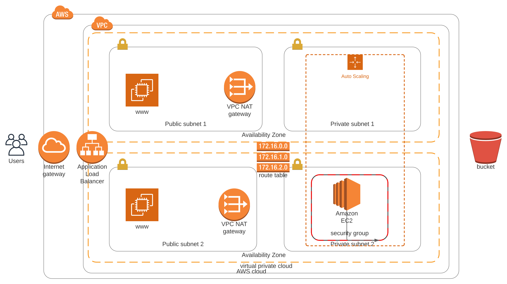

# Setting Up Lucid Charts

1. **Open** your browser and go navigate to [https://www.lucidchart.com/](https://www.lucidchart.com/)

1. **Click** the plus icon to create a new `Document`

1. **Click** on `Blank Diagram` to select a blank template.

* You should now have a blank Document that looks like this:

1. **Click** on the `Shapes` button in the top left of the control panel to access the `Shape Manager` screen

1. **Select** both `AWS Architecture 2017` & `AWS Architecture 2019` and then **Click** the `X` icon in the top right hand corner.

https://youtu.be/S7EDZcVBI3M

#### Region

A local business may be entirely contained in a region. So, if all your applications are always going to be deployed in the AWS Northern California region ( us-west-1 ) -for example- then you don't need to specify this in your diagrams because all your co-workers will already know this.

The exception would be if you are designing a multi-region architecture, say, for Disaster Recovery reasons. In this case, it's certainly useful to specify the region you are talking about, in your diagrams.

#### Recommended Read

[How to support multiple regions in AWS diagrams?](https://aws.amazon.com/answers/networking/aws-multiple-region-multi-vpc-connectivity/)

# Diagramming AWS accounts & regions

1. From the `Shapes` panel. Scroll down to the `Containers` and drag `AWS cloud` container onto your canvas.

1. **Stretch** your `AWS cloud` container to give yourself more room by dragging its corners.

1. **Search** for `users` and locate `AWS General Users`

1. **Drag** the `AWS General Users` onto your canvas.

1. **Rename** your `AWS General Users` shape to `Users`.

https://youtu.be/YSdCYC2QTDk

#### Glossary

**Availability Zones (AZ):** An AZ is a set of one or more data centers (physical building).

### Best Practices

* Choose to have more than one availability zone to avoid a single point of failure.
* Include more than one availability zone to design for high availability, .
* You may choose to reduce to one AZ, possibly for prototyping and design for low cost. But it is not recommended for production environments.

# Diagramming Availability Zones

1. **Locate** the `Availability Zone` shape from the `Containers` section.

1. **Drag** the `Availability Zone` shape inside of your existing `AWS cloud` container.

1. **Expand** your `Availability Zone`'s width within the `AWS cloud` container.

1. **Add** another `Availability Zone` container below your existing `Availability Zone` container by repeating the initial 3 steps.

* Your final result should look like this:

https://youtu.be/dYFNnYxsHCk

An IPv4 address is made up of four octets.

One octet is missing in the video above, as shown in the snapshot.

At timestamp 2:52, when the instructor says "_I could create 255 of this smaller subnets within our VPC by doing 10.0.2.0, 10.0.3.0, and so on_", he meant:
> 
> I could create 255 of this smaller subnets within our VPC by doing \[10.0.2.0, 10.0.2.1, 10.0.2.2, 10.0.2.3.....10.0.2.255\], \[10.0.3.0, 10.0.3.1, 10.0.3.2, 10.0.3.3...... 10.0.3.255\], and so on. (Ignore system-reserved IP addresses).

#### Glossary

**Virtual Private Cloud (VPC)**: A virtual private cloud is a pool of networked cloud resources. It can span more than one availability zone.  
The equivalent of this would be a data center. However, thanks to availability zones, VPCs can span more than one physical building. This is an amazing feature that protects against real world disasters like electrical failures, fires and similar events.

### Recommended Read

* [Classless Inter Domain Routing](https://en.wikipedia.org/wiki/Classless_Inter-Domain_Routing) (CIDR)
* [VPCs and Subnets in AWS](https://docs.aws.amazon.com/vpc/latest/userguide/VPC_Subnets.html)

1. **Locate** the `Virtual Private Cloud` container from the `Shapes` panel.

1. **Drag** the `Virtual Private Cloud` container onto your canvas.

1. Arrange your `Virtual Private Cloud` container so that it encloses both of your `Availability Zones`.

1. **Locate** the `VPC _subnet` container from the `Shapes` panel.

1. **Drag** the `VPC _subnet` container onto your canvas and place it inside of your first `Availability Zone`.

1. **Drag** another `VPC _subnet` container onto your canvas, but this time place it in your second `Availability Zone`.

1. **Rename** the top`VPC _subnet` container to `Public Subnet 1` and the bottom `VPC_subnet` container to `Public Subnet`.

https://youtu.be/R4uk2Z9BA4Y

#### Subnets

* A subnet is a subset of the overall VPC network and it only exists in a single availability zone, unlike its parent network, the VPC.
* A subnet contains resources, and can be assigned access rights that apply to all resources within that subnet.
* Subnets can be public or private. Public subnets are accessible to external users. Private subnets are only accessed internally by other resources within your cloud container.

#### Use IP addresses for routing traffic

* Use IP addresses as the "keys" for routing traffic. We can route traffic to stay within the VPC, or within a particular subnet, for security reasons.
* For example, a database or any sensitive data will be placed in a private subnet. A public server, like a web server, can be placed in a public subnet. Routing rules applied to a subnet allow us to define access to all resources placed inside that subnet.

# Public vs Private Subnets

1. **Drag** 2 new `VPC_subnet` containers onto your canvas.

1. **Place** one of the newly dragged `VPC_subnet` containers into each of your `Availability Zone` containers.

1. **Rename** all of your `VPC_subnet` containers to match the following:

https://youtu.be/YNEtyqVJPX4

#### Software Defined Networking

What we have created here it's called Software Defined Networking. That is, using APIs and already-existing physical infrastructure to create our own networking layer on top, with our own privacy rules, our own routing and our own Private IP Space.

#### VPN or Virtual Private Network

It is a type of encrypted connectivity that You can setup between your on-premise data center and your Virtual Private Cloud. This allows access in and out of your AWS VPC in a secure manner, across the internet and using internal, Private IP addresses.

#### DirectConnect

It is a DirectConnect is a physical data line that you can purchase directly from AWS or through a telecommunication service provider to access your AWS Cloud without moving your data traffic across the public internet.

#### Internet Gateway

* An internet gateway is a resource that enables inbound and outbound traffic from the internet to your VPC.
* An internet gateway allows external users access to communicate with parts of your VPC.
* If you create a private VPC for an application that is internal to your company, you will not need an internet gateway.

### Recommended Read

* [Read more about Internet Gateways](https://docs.aws.amazon.com/vpc/latest/userguide/VPC_Internet_Gateway.html)

https://youtu.be/-1PBVBWG7Xw

# IGW Internet Gateway

1. **Search** for `VPC internet gateway` in the search shapes panel.

1. **Drag** the `VPC internet gateway` shape onto your canvas and place it directly to the right of your `Users`.

https://youtu.be/FfMEAap0E30

# NAT's

1. **Search** the shapes panel for `VPC_NAT gateway`.

1. **Drag** the `VPC_NAT gateway` shape onto your canvas and place it directly inside `Public Subnet 1`.

1. **Repeat** step 3, but instead place your new `VPC_NAT gateway` inside of `Public Subnet 2`.

#### Glossary

**Autoscaling group**: It is a coherent group of Virtual Machines (EC2 instances) that allows running the exact number of VMs that are required to meet the demand/specification. The autoscaling group can automatically start or stop the servers (EC2 instances) according to the amount of incoming traffic. This behavior of the autoscaling group helps in two ways:

* The consumer pays for the only duration of the servers when they were active.
* The consumer doesn't have to worry about horizontal scaling of servers for a sudden peak in incoming traffic.

#### Best Practice

* It is recommended that an autoscaling group **spans more than one availability zone, for reliability**.
* If we set the autoscaling group to run one resource, it will run that one resource in one of the availability zones.
* If there is a failure of that resource, the autoscaling group will shut it down in that availability zone and start that same resource in the other availability zone.

### Recommended Read

* [Read more about autoscaling group](https://docs.aws.amazon.com/autoscaling/ec2/userguide/AutoScalingGroup.html)

# Autoscaling Groups

1. **Search** the shapes panel for `EC2` compute service.

1. **Drag** the `EC2` computer service onto your canvas and place it directly inside `Public Subnet 1`, to the left of your `VPC_NAT gateway`.

1. **Rename** the `EC2` compute service to `WWW`.

1. **Duplicate** your `EC2` compute service and place it inside `Public Subnet 2`.

1. **Search** the shapes panel for `Auto Scaling` and locate the one under `Group Icons`.

1. **Drag** the `Auto Scaling` group icon onto your canvas and place it inside `Private Subnet 1`.

1. **Resize** the `Auto Scaling` group icon so that it starts in `Private Subnet 1`, then extends and covers `Private Subnet 2`.

https://youtu.be/JNZUMDSNlwI

https://youtu.be/IlVOOlctIkc

#### Load Balancer

* A load balancer takes incoming traffic and distributes it to two or more resources. For example, it can take inbound user requests to access your website, and it can distribute the requests evenly among two or more servers.
* Without a load balancer, having public-facing servers in more than one AZ would mean that users would have to use a different URL to reach each of the AZs. This can be impractical compared to just a single URL.
* **Good practice** - Assume we have a set of web-servers in private subnet(s). Then, we must have a Load Balancer that would access our web-servers. These web-servers, in turn, would access the backend database.

#### AWS - Elastic Load Balancing

We recommend you to read about three types of load balancing offered by AWS at different layers of networking protocol:

1. [Classic load balancer](https://docs.aws.amazon.com/elasticloadbalancing/latest/classic/introduction.html)
2. [Application load balancer](https://docs.aws.amazon.com/elasticloadbalancing/latest/application/introduction.html)
3. [Network load balancer](https://docs.aws.amazon.com/elasticloadbalancing/latest/network/introduction.html)

**Important:** Before this section we have taken the liberty of add the following to our diagram:

1. AutoScaling group in the Private Subnet 1\.
2. An EC2 instance directly inside of Private Subnet 2\. It is in addition to web servers (EC2 instances) in the public subnets.

Please take the time to add this to your diagram before continuing with this exercise.

1. **Search** shapes panel for `Compute` section and find the `Application Load Balancer` .

1. **Drag** the `Application Load Balancer` onto your canvas and place it on the right side of your `Internet Gateway`.

https://youtu.be/Xg4NDlUsC9U

#### Security Groups

* Security groups manage traffic at the server level (the resource level). Security Groups aren't for managing higher-level groups such as subnets, VPC, or user accounts.
* The same security group can be assigned to multiple resources that require the same security access settings defined by that security group.

### Recommended Read

* [Read more about Security Groups](https://docs.aws.amazon.com/vpc/latest/userguide/VPC_SecurityGroups.html)

1. **Search** the shapes panel in the `Containers` section and locate the `Security Group` container .

1. **Drag** the `Security Group` container and place it on top of `Private Subnet 2`.

1. **Resize** the `Security Group` container so that it is only surrounding our `EC2 Instance` .

https://youtu.be/BTej1k7r6Qg

**Note**  
The entries in a routing table are about information regarding how to "move traffic" not about allowing or denying traffic. A routing table defines the **rules**, meaning if a packet arrives for a particular **destination**, then it should be moved towards the defined **target**.

* To allow/deny traffic at the network/subnetwork level you have ACLs!.
* To allow/deny traffic at an instance level, you have security groups.

See the snapshots below to understand the difference between the three:

Routes (rules) in a sample route table, defining the traffic movement rules.

A sample ACL, allowing specific traffic at subnet/VPC level. See both, inbound and outbound rules.

A sample SG, allowing specific traffic at an EC2 instance level. See both, inbound and outbound rules.

### Recommended Read

* [Read more about route tables](https://docs.aws.amazon.com/vpc/latest/userguide/VPC_Route_Tables.html)

https://youtu.be/Oz-JEyhrkIM

1. **Search** the shapes panel for `Route Table`.

1. **Drag** the `Route Table` and place it in the center of your 4 `Subnets`.

https://youtu.be/8arlUCAVK38

#### S3

* An S3 bucket is a public service for users to upload or download files.
* Place the S3 service **outside of your VPC**.

In the following quiz you'll see an option for **Log files** as one of the possible answers, please keep in mind that this means **sanitized** logs, which means: with all sensitive information removed, such as passwords, credit card numbers or similar info.

1. **Search** the shapes panel for `S3 Bucket`.

1. **Drag** the `S3 Bucket` and place it on the outer exterior of your `AWS Cloud Container`.

https://youtu.be/PtMvsoHwbWY

**Note**  
In the upcoming lessons, you will **create the VPC** and the resources contained therein, as shown in the diagram. Since an S3 does not reside in your VPC, let's exclude it from your final diagram. Though, you will learn to create S3 buckets and their policies programmatically in the last lesson.

https://youtu.be/8yhBjDOeCbs

## Summary

As this lesson comes to an end, now you must be able to...

* Make use of [www.lucidchart.com](http://www.lucidchart.com/) to draw the diagrams.
* Identify the AWS resources that are required to be used in the diagrams.
* Place the resources correctly in the diagram, such as VPC, availability zones, subnets, internet gateway, NAT gateway, autoscaling groups, load balancers, and EC2 instances.

### Review the AWS Reference Architecture Page

