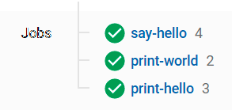

## Exercise: Creating a Simple Workflow

Create a workflow that combines a few simple jobs and executes without failure.

### Instructions:

1. Follow [the instructions in the CircleCI 2.0 documentation](https://circleci.com/docs/2.0/getting-started/) to set up your first pipeline. Create a new repository in Github or select an existing repository. Don't go too far in the tutorial! We suggest you stop just before getting to the "Breaking Your Build" section.
2. Clone the repository to your local computer. Change to the branch Circle CI created.
3. Open the `.circleci/config.yaml` file with the code editor of your choice.
4. You'll notice a config that looks like this:
    
    # Use the latest 2.1 version of CircleCI pipeline process engine. See: https://circleci.com/docs/2.0/configuration-reference version: 2.1 # Use a package of configuration called an orb. orbs: # Declare a dependency on the welcome-orb welcome: circleci/welcome-orb@0.4.1 # Orchestrate or schedule a set of jobs workflows: # Name the workflow "welcome" welcome: # Run the welcome/run job in its own container jobs: - welcome/run 

5. Add a `jobs` section between the `orbs` and `workflows` sections.
6. Add two jobs named something like `print_hello` and `print_world`.
  * Both jobs should use the [Docker executor](https://circleci.com/docs/2.0/executor-types/#using-docker) and a lightweight image like `circleci/node:13.8.0`.
  * Both jobs should have a `steps` section that runs a simple bash command.
  * To run a bash command, add a `run` line followed by your bash instructions. We'd like to print (`echo`) "hello" in one job and "world" in the other.
7. Add your job names to the `workflows` section so that they run in sequence.
8. Use the ["requires" key](https://circleci.com/docs/2.0/configuration-reference/#requires) to make your `print_world` job wait for the `print_hello` job to finish.

Solution:
https://github.com/ovimihai/cdond-circle-ci-exercise1/blob/circleci-project-setup/.circleci/config.yml

https://youtu.be/Oi2iLwWKJY4
