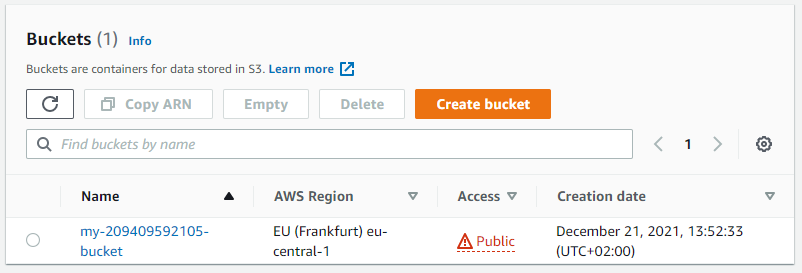
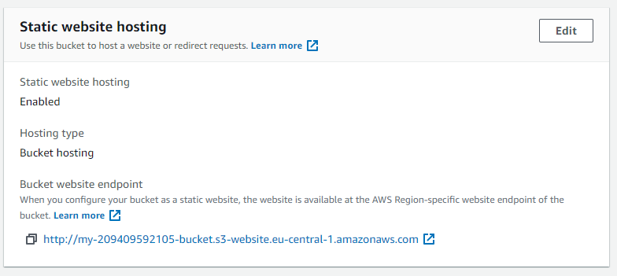
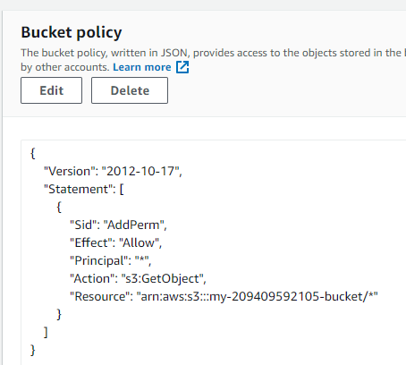
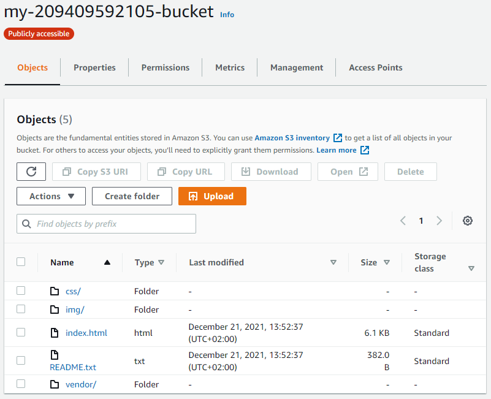
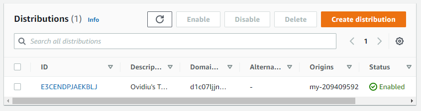
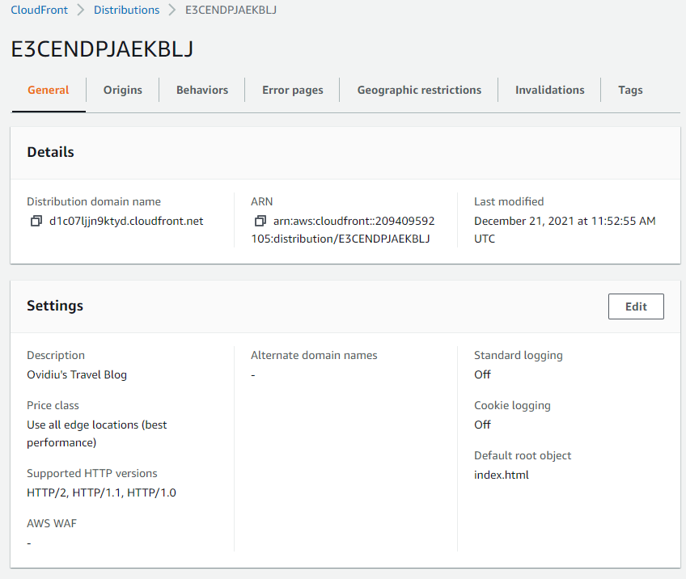
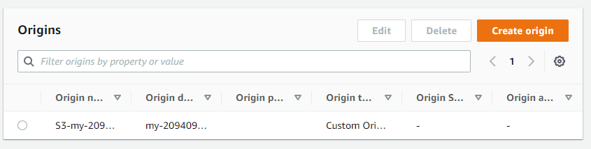

# Deploy Static Website on AWS

## Create S3 bucket

## Configure S3 bucket

## Copy website files to S3 bucket

## Visit S3 website

## Create CloudFront distribution

## Visit CloudFront site

