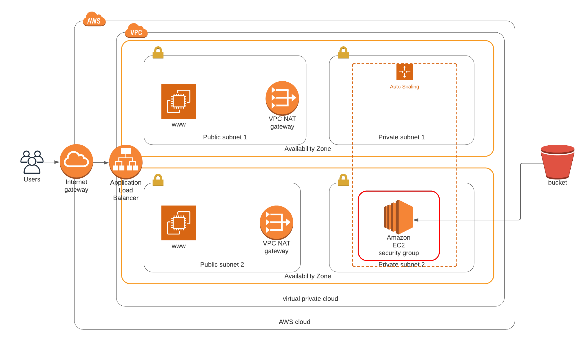
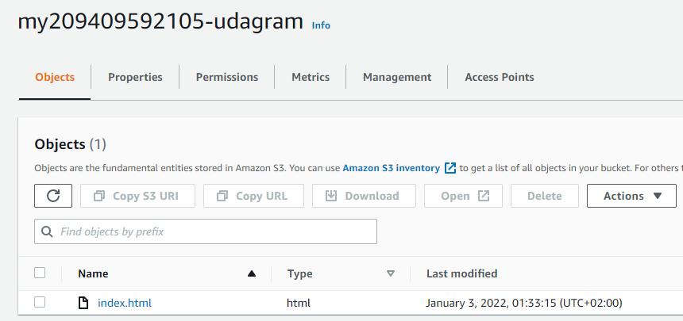
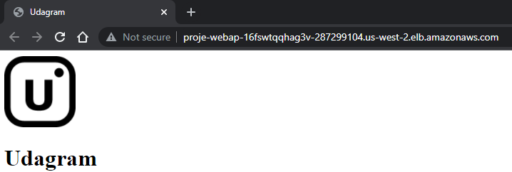

# Deploy a high-availability web app using CloudFormation

## Application diagram


## Website source



## Deploy
```bash
update.bat project3 .stack.yml .stack.json
```

## Check outputs


## Verify website



